# Embedded Vision Sensor Fusion

## Purpose


## 1. Install OpenCV

### Step #1 : Expand filiesystem

---

```shell
$ sudo raspi-config
```

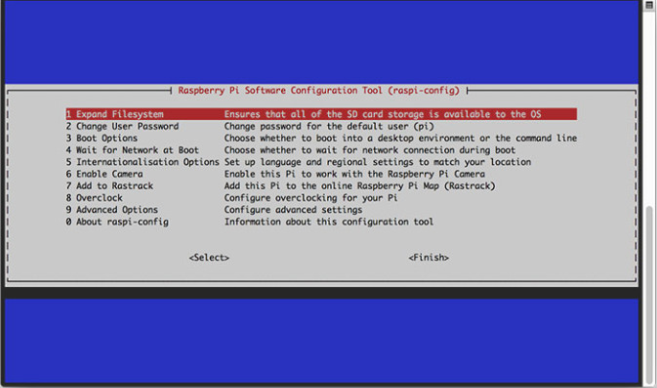

and ***"<Finish>"*** and then reboot

```shell
$ sudo reboot
```

OpenCV need a few gigabytes during the compile, so you should delete the Wolfram engine to free up some space on your Pi.

```shell
$ sudo apt-get purge wolfram-engine
```

### Step #2 : Install dependencies

---

First step is to update and upgrade

```shell
$ sudo apt-get update
$ sudo apt-get upgrade
```

Install some developer tools which helps us configure the OpenCV build process

```shell
$ sudo apt-get install build-essential cmake pkg-config
```

We need to install some image I/O packages that us to load various image file formats from disk.

```shell
$ sudo apt-get install libjpeg-dev libtiff5-dev libjasper-dev libpng12-dev
```

We also need video I/O packages

```shell
$ sudo apt-get install libavcodec-dev libavformat-dev libswscale-dev libv4l-dev
$ sudo apt-get install libxvidcore-dev libx264-dev
```

In order to compile the **highgui** module, we need to install the **GTK** development library.

```shell
$ sudo apt-get install libgtk2.0-dev
```

Many operations inside of OpenCV (namely matrix operations) can be optimized further by installing a few extra dependencies

```shell
$ sudo apt-get install libatlas-base-dev gfortran
```

Lastely, let`s install both the Python2.7 and Python3 header files so we can compile OpenCV with Python bindings.

```shell
$ sudo apt-get install python2.7-dev python3-dev
```

### Step #3 : Download the OpenCV source code

---

We have out dependencies installed. Let`s grab the **3.1.0** archive of OpenCV from the official **OpenCV repository**.

```shell
$ cd ~
$ wget -O opencv.zip https://github.com/Itseez/opencv/archive/3.1.0.zip
$ unzip opencv.zip
```

We`ll want the full install op OpenCV 3, so we also need to grab the **opencv_contrib** repository.

```shell
$ wget -O opencv_contrib.zip https://github.com/Itseez/opencv_contrib/archive/3.1.0.zip
$ unzip opencv_contrib.zip
```

### Step #4 : Python 2.7 or Python 3?

---

Before we can start compiling OpenCV on out Raspberry Pi 3, we first need to install **pip**

```shell
$ wget https://bootstrap.pypa.io/get-pip.py
$ sudo python get-pip.py
```

also install vitualenv, virtualenvwrapper

```shell
$ sudo pip install virtualenv virtualenvwrapper
$ sudo rm -rf ~/.cache/pip
```

and then, we need to update our ~/.profile file

you should use **nono**

```shell
$ nano ~/.profile
```

and include the following lines at the **bottom** of the file

```shell
# virtualenv and virtualenvwrapper
export WORKON_HOME=$HOME/.virtualenvs
export VIRTUALENVWRAPPER_PYTHON=/usr/bin/python3
source /usr/local/bin/virtualenvwrapper.sh
```

Otherwise, you should simply use **cat** and output redirection to handle updating

```shell
$ echo -e "\n# virtualenv and virtualenvwrapper" >> ~/.profile
$ echo "export WORKON_HOME=$HOME/.virtualenvs" >> ~/.profile
$ echo "export VIRTUALENVWRAPPER_PYTHON=/usr/bin/python3" >> ~/.profile
$ echo "source /usr/local/bin/virtualenvwrapper.sh" >> ~/.profile
```

And then, just use the **source** command.

```shell
$ source ~/.profile
```

*Note*: Recommend running the **source ~/.profile** file each time you open up a new terminal to ensure your system variables have been setup correctly.


Creating Python virtual environment

for python2

```shell
$ mkvirtualenv cv -p python2
```

for python3

```shell
$ mkvirtualenv cv -p python3
```


Check if you`re in the "cv" virtual environment

```shell
$ source ~/.profile
$ workon cv
```

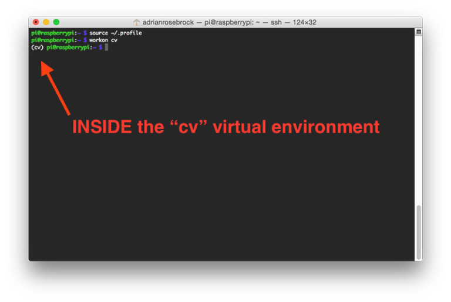

if you see ***(cv)*** in front of prompt, then you are in the "cv" virtual environment.

if you go out from "cv" you can use both following lines.

```shell
$ workon cv
$ deactivate
```


Next, installing NumPy on your Raspberry Pi.

```shell
$ pip install numpy
```


### Step #5 : Compile and Install OpenCV

---

First, you should in the "cv"

```shell
$ workon cv
```

then setup our build using CMake.

```shell
$ cd ~/opencv-3.3.0/
$ mkdir build
$ cd build
$ cmake -D CMAKE_BUILD_TYPE=RELEASE \
    -D CMAKE_INSTALL_PREFIX=/usr/local \
    -D INSTALL_PYTHON_EXAMPLES=ON \
    -D OPENCV_EXTRA_MODULES_PATH=~/opencv_contrib-3.3.0/modules \
    -D BUILD_EXAMPLES=ON ..
```

then, check your Python3 or Python2 section looks like the figure below

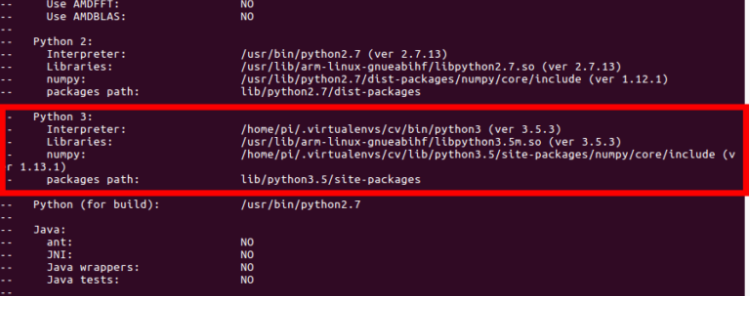


**Configure your swap space size before compiling**

Open your             and then edit the **CONF_SWAPSIZE**  variable.

```shell
# set size to absolute value, leaving empty (default) then uses computed value
#   you most likely don't want this, unless you have an special disk situation
# CONF_SWAPSIZE=100
CONF_SWAPSIZE=1024
```

**If you skip this step, OpenCV might not compile.**

To activate the new swap space, restart the swap service.

```shell
$ sudo /etc/init.d/dphys-swapfile stop
$ sudo /etc/init.d/dphys-swapfile start
```


Finally, we are now ready to compile OpenCV. You can build use 1 core or more than.

```shell
$ make
$ make -j2
$ make -j4
```

Build spend so long time...about 3~4 hours.

If you finish **make** your output should look similar to below

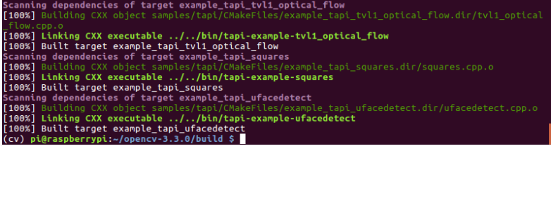

From there, all you need to install OpenCV 3 on your Raspberry Pi 3

```shell
$ sudo make install
$ sudo ldconfig
```

### Step #6 : Finish installing OpenCV on your Pi

---

For Python 3:

first you can verify where are **OpenCV + Python bindings** installed with the ***ls*** command.

```shell
$ ls -l /usr/local/lib/python3.5/site-packages/
total 1852
-rw-r--r-- 1 root staff 1895932 Mar 20 21:51 cv2.cpython-34m.so
```

and then rename the file.

```shell
$ cd /usr/local/lib/python3.5/site-packages/
$ sudo mv cv2.cpython-35m-arm-linux-gnueabihf.so cv2.so
```

then sym-link the OpenCV bindings into our "cv" virtual environment for Python

```shell
$ cd ~/.virtualenvs/cv/lib/python3.5/site-packages/
$ ln -s /usr/local/lib/python3.5/site-packages/cv2.so cv2.so
```

### Step #7 : Testing OpenCV 3 install

---

```shell
$ source ~/.profile 
$ workon cv
$ python
>>> import cv2
>>> cv2.__version__
'3.3.0'
>>>
```

Congratulations!

### 1 - 1. Why we use vitual environment?

The virtual environment of python is just a small python installation, and it`s just a basket to run only the modules i want.

This is the same context as a virtual machine that creates a new OS within an OS.

The virtual environment can be used in a wide variety of ways, such as creating a minimal environment for running python programs, and linking with repositories such as github.

### 1 - 2. Why configure swap_size before compiling? and What is swap partition?


## 2. Face Detection

### Step #1 : OpenCV Samples

---

You can see many samples in OpenCV.

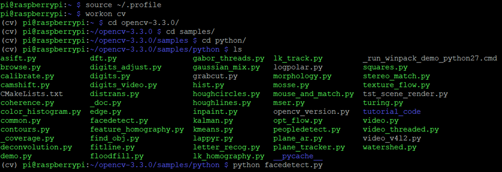

We use **facedetect.py**

```shell
(cv) $ source ~/.profile
(cv) $ workon cv
```

And then, execute facedetect.py in over folder

```shell
(cv) $ python facedetect.py
```

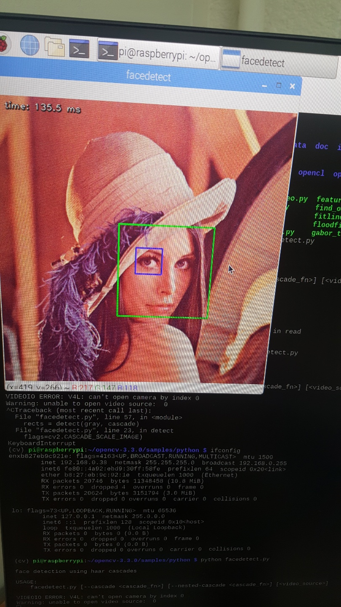


## 3. Pylepton Overlay - Thermal Image Sensor

#### Using Pi Camera

Open up Pi Camera module.

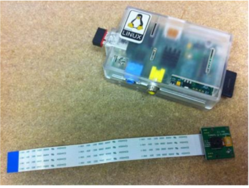

Inserting the cable into the Raspberry Pi.

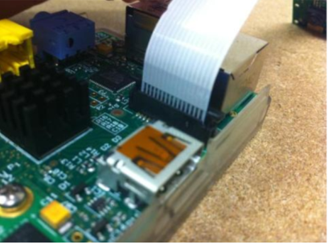

First, update and upgrade Raspberri Pi.

```shell
$ sudo apt-get update
$ sudo apt-get upgrade
```

Run raspi-config and "camera" option enable.

```shell
$ sudo raspi-config
```

Select "Finish" and reboot Raspberry Pi.

Here is Raspistill command.

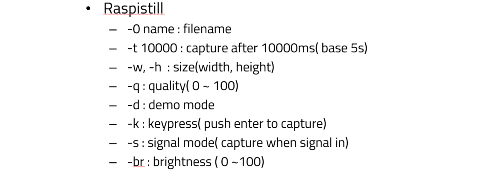

Let`s capture the image.

```shell
$ Raspistill -o image.jpg
```

This command capture 5 second later.(defalut = 5s)

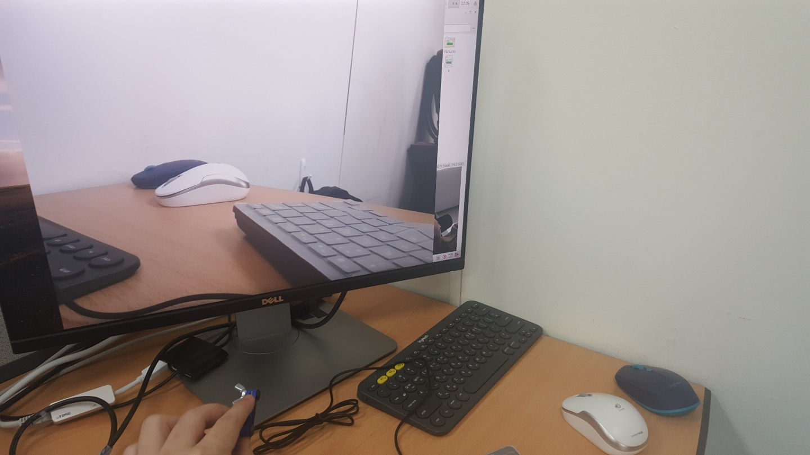

```shell
$ Raspistill -br 60 -k -o b
```

Brightness 60, keypress mode, name is b

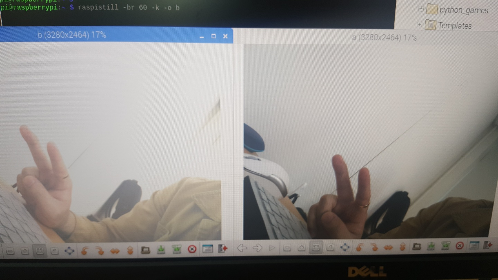

left is -br80 , right is -br 60

## 4. PIR(Passive Infrared) Sensor

## 5. Ultrasonic wave Sensor

## 6. Video Surveillance System


