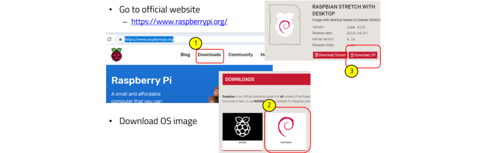
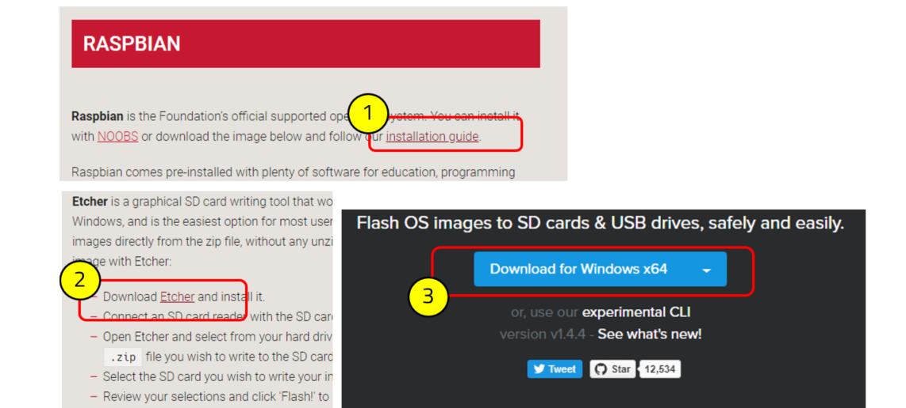
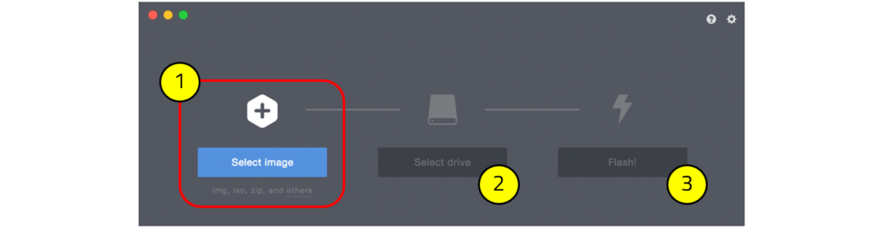
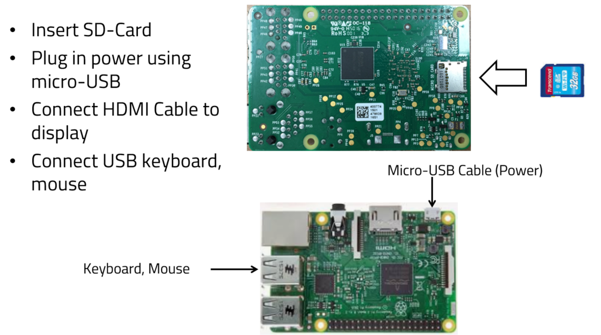
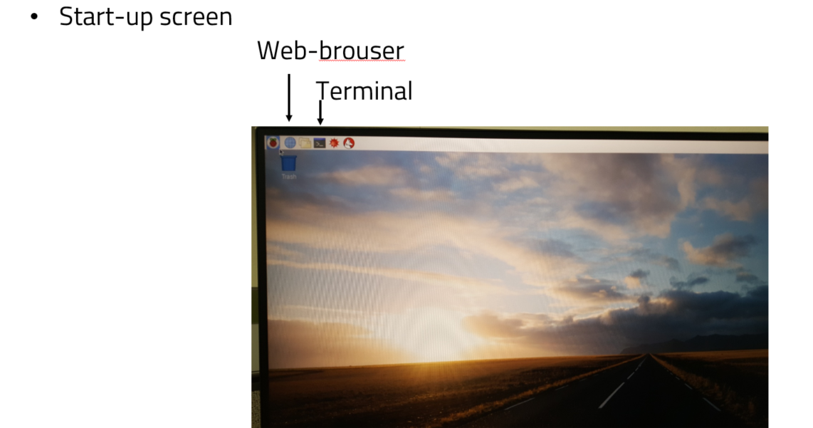
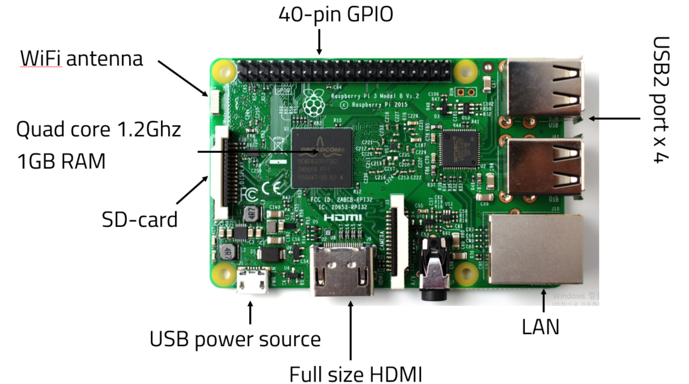
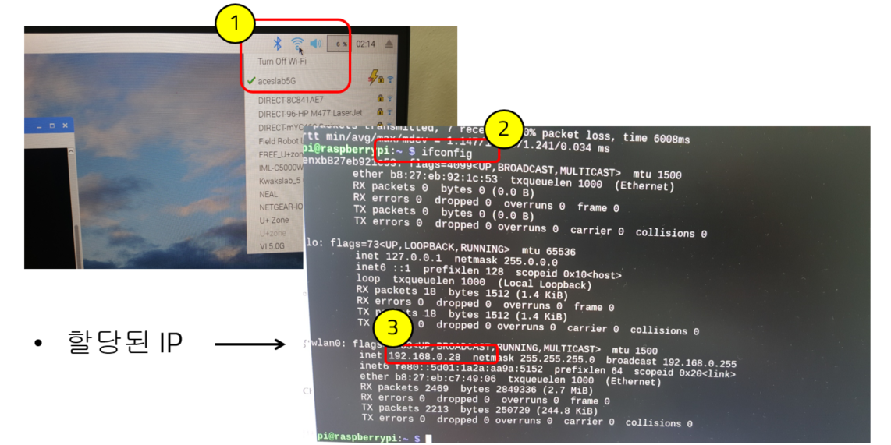
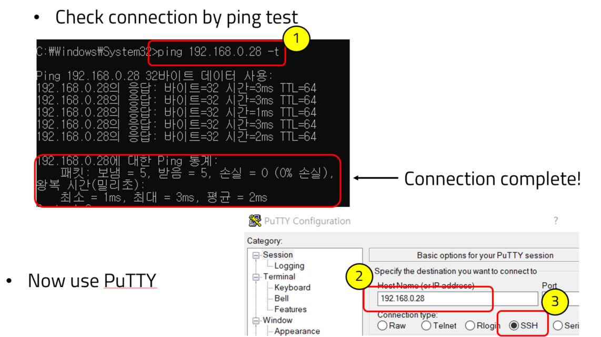
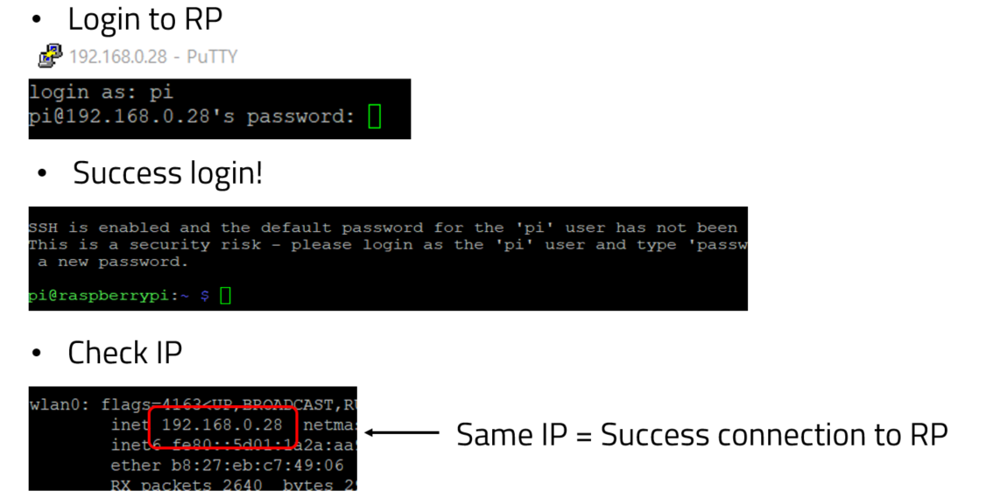

# Rasberrypi setup

## Preparation of OS

#### Downloading Operating System

Go to official website –<https://www.raspberrypi.org/>

Read installation guide –<https://www.raspberrypi.org/downloads/raspbian/>

Flashing(Writing) OS image into SD-Card

Booting Linux from SD-Card

you can see start-up screen.

## Basic of RP

#### RP3 Model B Spec

#### Wi-Fi Setup

와이파이가 기본적으로 있기 때문에 PC연결하듯이 하면 된다.

#### Connect to RP via SSH

If you complete the connection RP to host PC, and then login to RP.

You success connect RP to host PC!

