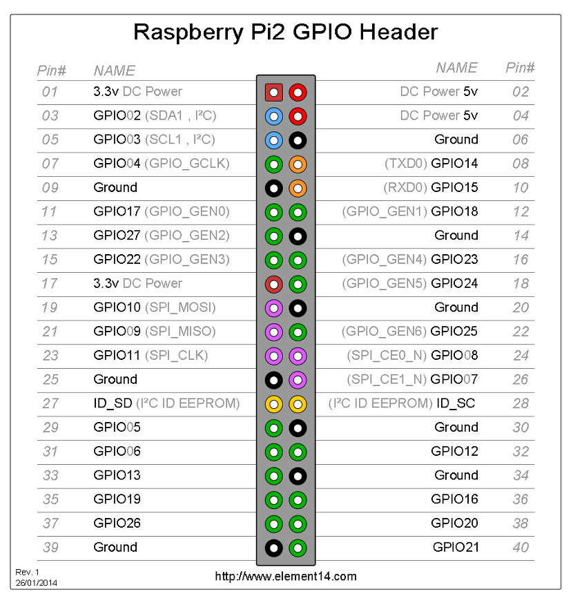
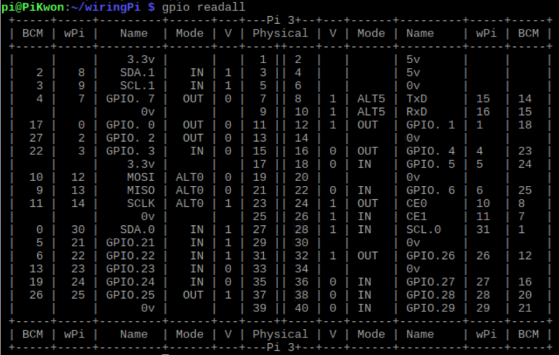
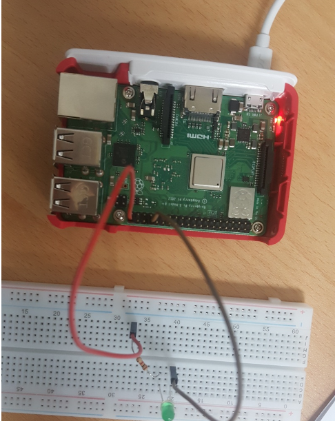
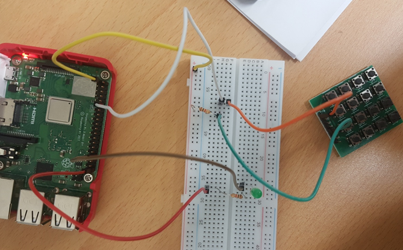
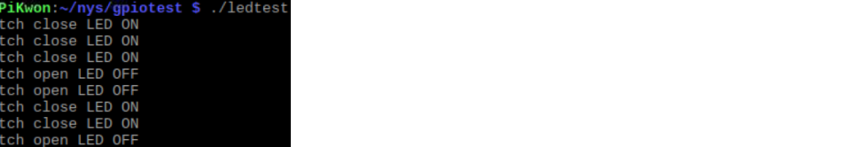
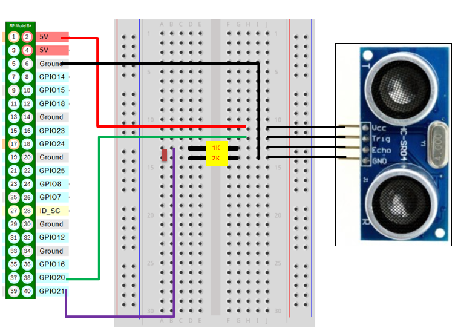
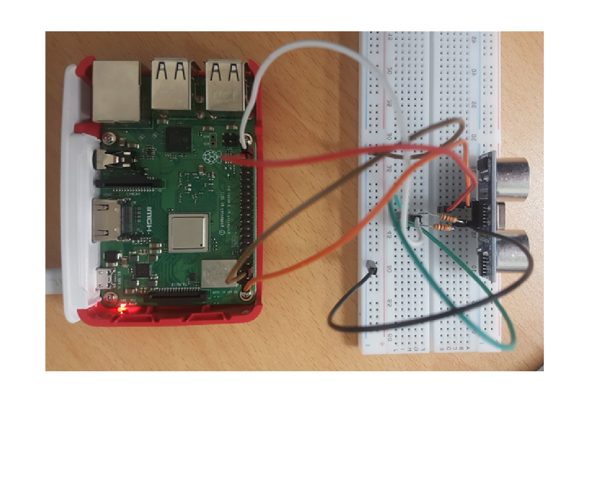
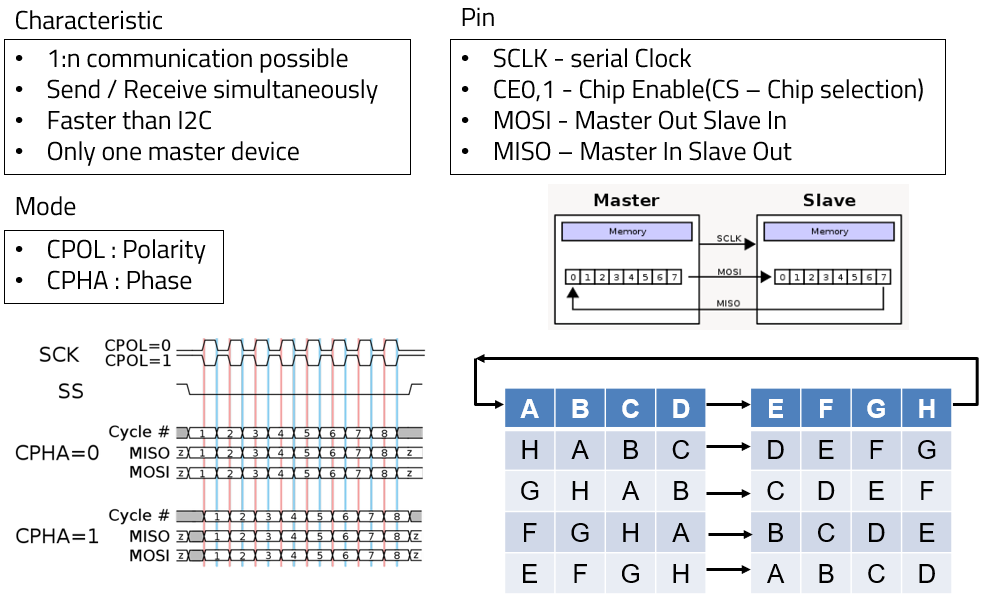
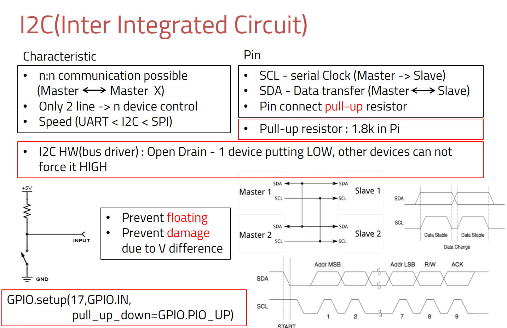

# Raspberri GPIO test

```shell
$ sudo apt-get install git-core
$ git clone git://drogon.net/wiringPi
$ cd wiringPi
$ ./build
```

check the installation is good.

```shell
$ gpio-v gpio readall
```

and then check your raspberri GPIO

```shell
$ gpio readall
```




and then your GPIO is like below.



You can see gpio21 in BCM is 29 in wiringPi.

## 0. 주의할 점

#### 전원 구성

라즈베리파이에는 3.3v, 5v 의 전원핀이 있다. 그러나 GPIO관련하여 사용할 때는 3.3v의 회로만을 구성해야 한다.그 이유는 라즈베리파이의 동작 전원이 3.3v이고 그 이상의 전원에 대하여 보호하는 기능이 없다. 즉, 5v는 단순히 USB선으로 들어오는 5v전원을 연결했을 뿐 실제 라즈베리파이는 3.3v 범위안에서 작업을 해야 한다.

또한 대략 0.7v이하는 0또는 LOW로 인식하며, 2.7v~3.3v까지를 1또는 HIGH로 인식한다.

#### 전류 사용

3.3v의 핀은 최대 30mA의 전류를 사용 가능하다. 그 이상의 전류가 필요한 회로를 구성하게 되면 라즈베리파이의 메인 회로에 문제가 생길 수 있다.

## 1 . LED

Circuit



Makefile

```shell
led:
	gcc -o ledtest led_test.c -lwiringPi
sw:
	gcc -o swtest sw_test.c -lwiringPi
```

led_test.c

```c
#include <stdio.h>
#include <wiringPi.h>

int main(){
    
    int i;
    if(wiringPiSetup() == -1) return -1;
    
    pinMode(29,OUTPUT);
    for(i=0; i < 5; i++){
        
        digitalWrite(29,1);
        delay(500);
        digitalWrite(29,0);
        delay(500);
    }
    return 0;
}
```

코드를 돌려보면 0.5초 딜레이를 갖고 켜졌다 꺼졌다 하는 것을 확인할 수 있다.

여기에 스위치를 달아서 눌렀을땐 led가 off되도록 해보면,



sw_test.c

```c
#include <stdio.h>
#include <wiringPi.h>

#define SW1 1 // BCM_GPIO 18
#define LED1 29 // BCM_GPIO 29

int main() {
    
    int i;
    
    if(wiringPiSetup() == -1) return -1;
    
    pinMode(SW1, INPUT);
    pinMode(LED1, OUTPUT);
    for(;;){
        
        if(digitalRead(SW1) == 1){
            printf("Switch open LED OFF\n");
            digitalWrite(LED1,0);
            delay(1000);
        }
        else {
            printf("Swtich close LED ON\n");
            digitalWrite(LED1, 1);
            delay(1000);
            
        }        
    }
    return 0;
}
```

아래와 같이 스위치를 눌렀을땐 OFF가 뜨는것을 알 수 있다.



## 2. Ultrasonic Wave Sensor

Circuit

 

여기서 중요한 점은 sensor의 echo부분은 5V를 내보낸다. 그러나 GPIO에는 3.3V를 줘야 하기때문에 1K, 2K저항으로 전압분배에 의해 3.3V만 GPIO pin에 가도록 설계해줘야 한다.

Makefile

```c
ultra:
	gcc -o ultratest ultra_test.c -lwiringPi
```

Code

```c
#include <stdio.h>
#include <stdlib.h>
#include <wiringPi.h>

#define trig 28 // BCM 20
#define echo 29 // BCM 21

int main() {
    
    int start_time, end_time;
    float distance;
    
    if(wiringPiSetup() == -1) return -1;
    
    pinMode(trig, OUTPUT);
    pinMode(echo, INPUT);
    
    while(1) {
        
        digitalWrite(trig, LOW);
        delay(500);
        digitalWrite(trig, HIGH);
        delayMicroseconds(10);
        digitalWrite(trig, LOW);
        
        while (digitalRead(echo) == 0);
        start_time = micros();
        while (digitalRead(echo) == 1);
        end_time = micros();
        // us(micro sec) / 58 = centimeters (sensor date sheet)
        distance = (end_time - start_time) / 29. / 2. ;
        printf("Distance is %.2f cm\n", distance);
  	}
    return 0;
}
```

result


## 3. SPI, I2C

### SPI



### I2C



