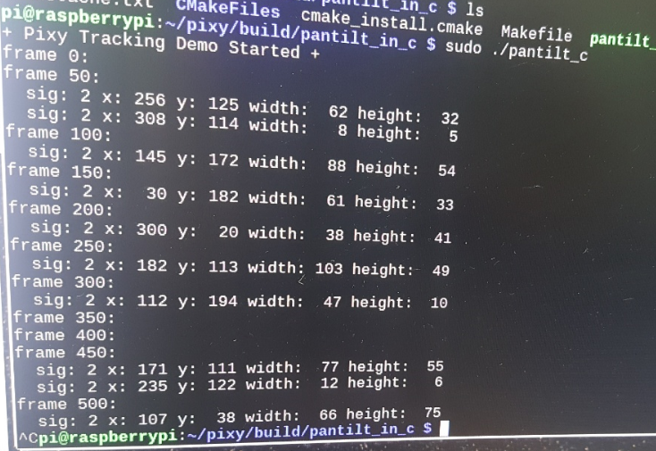
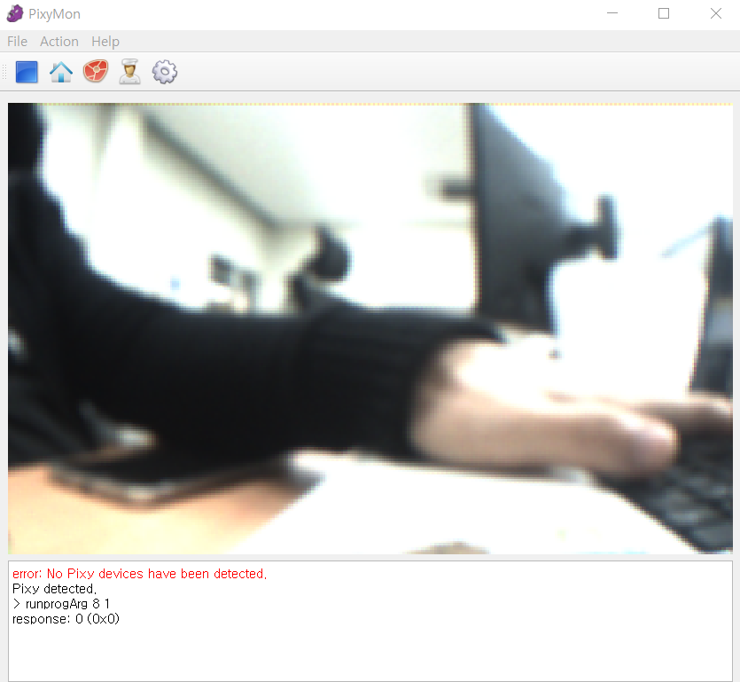
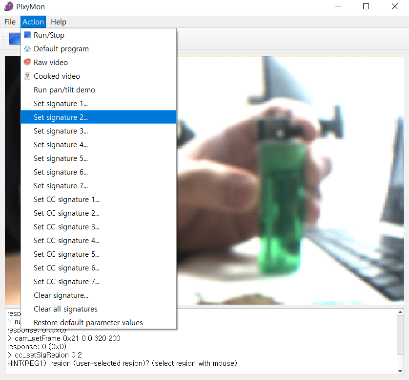
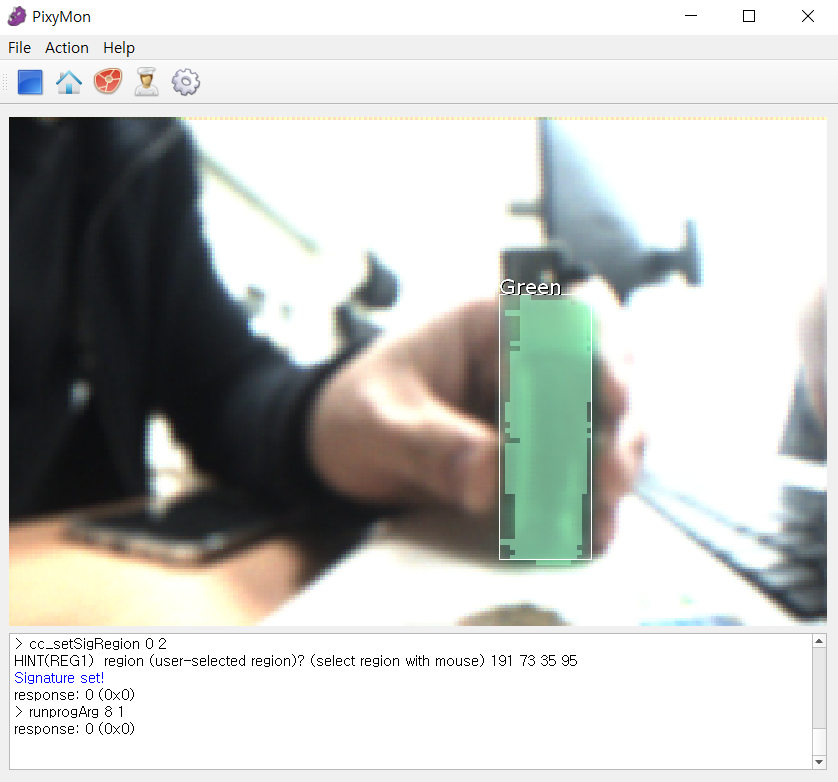
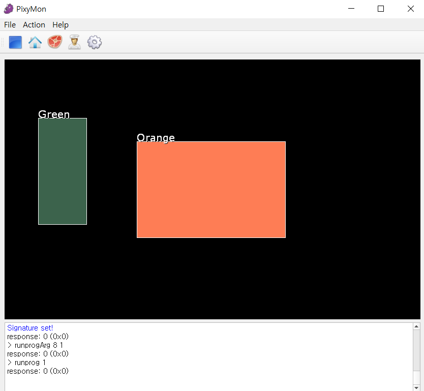
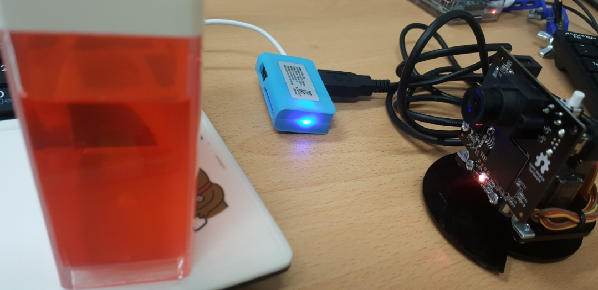
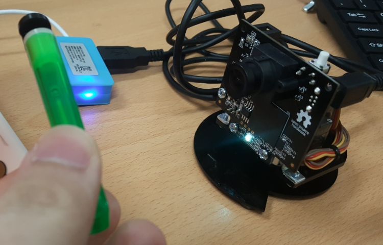

# Smart Eye

##  1. Crowd Moving-Human Face Detection

## Fusion-Sensor + Signal Processing + Embedded System(High perfomance SW) + Control(motor)

## Purpose

_Pylepton_Overlay/01_figs/15_Smart_Eye_Purpose.png)


### 1 . Operation of each Sensor

#### PIXY Vision Sensor(CMUcam6) & Pan/Tilt Mechanism kit

I use PIXY Vision Sensor(CMUcam6) with Pan/Tilt Mechanism kit

How to make is.. [http://www.cmucam.org/projects/cmucam5/wiki/Building_The_PanTilt_1](http://www.cmucam.org/projects/cmucam5/wiki/Building_The_PanTilt_1)

_Pylepton_Overlay/01_figs/16_Pixy_sensor.png)

Then connet to Raspberry Pi

_Pylepton_Overlay/01_figs/17_pixy_connect_pi.png)

When the connection is complete, several steps are required.

```shell
$ sudo apt-get install libusb-1.0-0.dev
$ sudo apt-get install libboost-all-dev
$ sudo apt-get install cmake
$ git clone https://github.com/charmedlabs/pixy.git
$ cd pixy/scripts
$ ./build_libpixyusb.sh
$ ./build_hello_pixy.sh
$ ./build_pantilt_c_demo.sh
$ sudo ./install_libpixyusb.sh
$ cd ../build/hello_pixy
$ sudo ./hello_pixy
$ sudo ./pantilt_c
```

Then you can see output like below.



But, to see these results, you have to learn pixy.


First, you have to download 'PixyMon' for your OS.

[pixymon]: http://cmucam.org/projects/cmucam5/wiki/Latest_release

then, run PixyMon. Here is initial screen.



Let`s Set signature green color.



if you success you can see like below.



And then, run Pan/Tilt demo..



you can see 2color signatures!


Pixy changes the LED color according to which color it recognizes






#############여기서부터 다시 정리##########

학습시키기 링크 : https://blog.naver.com/roboholic84/220569046780

http://www.cmucam.org/projects/cmucam5/wiki/Teach_Pixy_an_object


#### Pylepton - FLIR


#### Ultrasonic Wave Sensor


#### PIR(Passive Infrared)


### 2. Sensor-Communication(SPI, I2C, UART..)


### 3. Signal-Process & Motor Control


### 4. System Implementation

