# Compiler in C

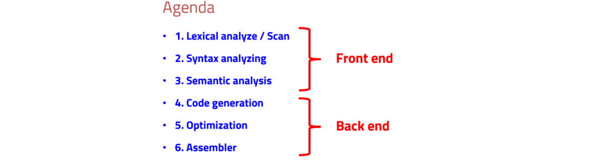

## Purpose

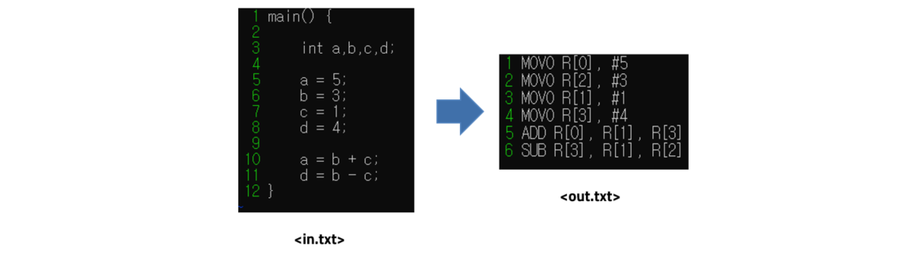

## Conditions

Type : int   /  Operation : '+', '-'

Two operand in a line

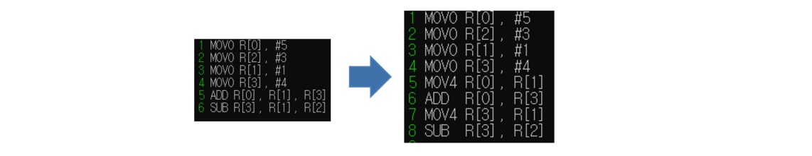

## 1. Lexical analyze / Scan

#### 1. 문자열(input-code)를 의미 있는 token으로 변환.

input code

```c
main() {
    int a,b,c,d;
    
    a = 5;
    b = 3;
    c = 1;
    d = 4;
    
    a = b + c;
    d = b - c;
}
```

#### 2. Output : token, syntax_list.

first, Store input code in buffer[] except 'tab', 'enter'

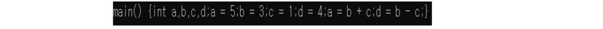

second, Store input-code in buffer[] except ';'  'space'  ','

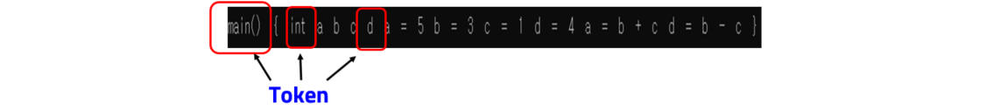

now, we make Tokens!

Then, i manage tokens with syntax_list.

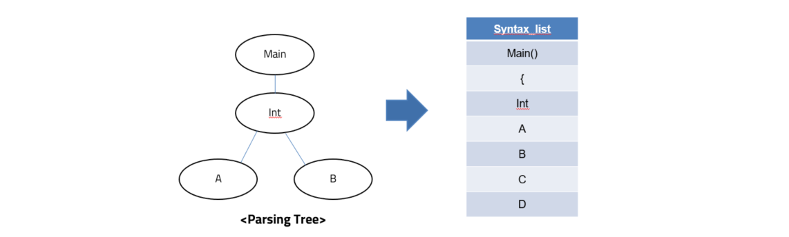

because list is easy to control for me.

## 2. Syntax analyzing

first, Classifying Variable / Operator like below.

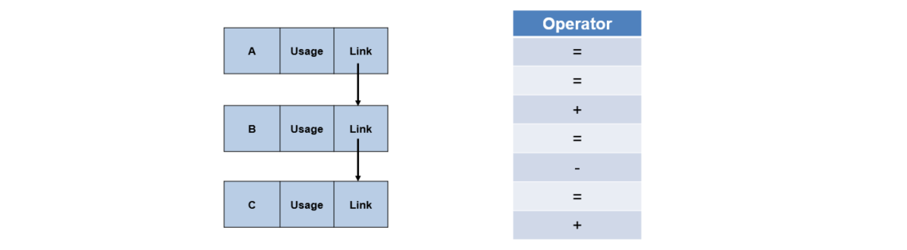

Manage variable in Linked-list, and operator in linear list. Operator is used for code generation, so i use linear list for easy to code generation.

#### Classifying variables

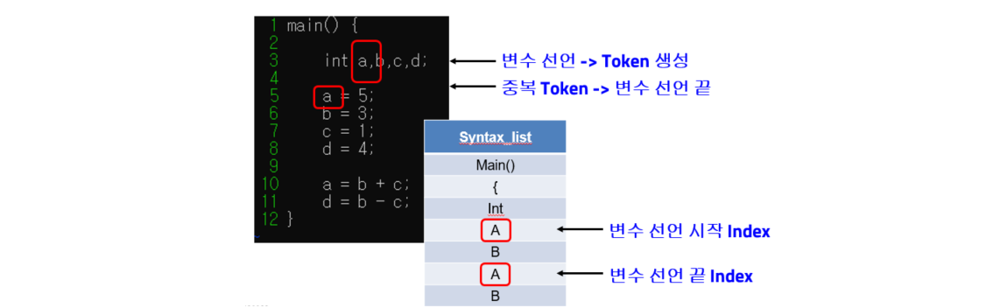

So, start index = start / end index = last

```c
for(cnt = start; cnt < last; cnt++){
    Add_list(L1, syntax_list[cnt]);
    for(_cnt = last; syntax_list[_cnt]; _cnt++){
        if(strcmp(syntax_list[cnt], syntax_list[_cnt]) == 0){
            (L1->last->usage)++;
        }
    }
}
```

There is a section to check the usage, which is to give priority.

It is so important to compile, because when the number of registers is fixed and when there are many variables, the priority is determined and the registers are allocated.

So, if there is 16registers, 17st var is in to Memory.

But, there is big Problem.

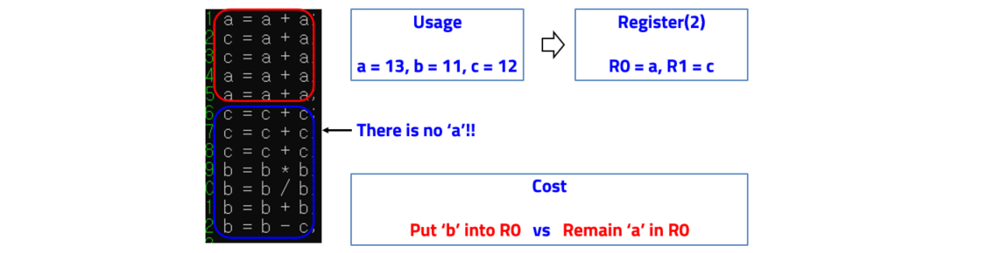

So you must control register usage for optimization.

#### Classifying Operator

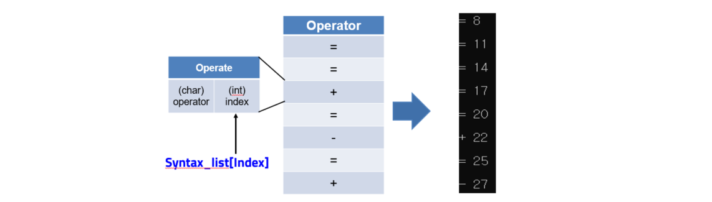


## 3. Code generation

We use Operator list for Code generation.

.png)

#### MOV3

in assembler, MOV3 is register to register.

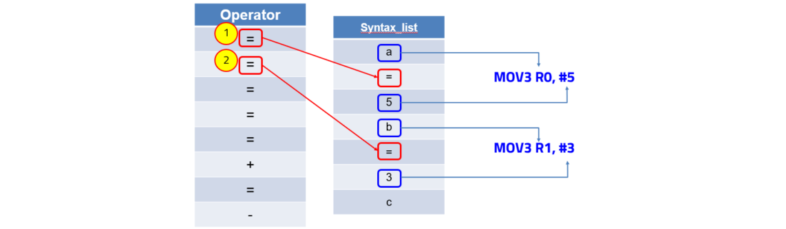

#### MOV4, ADD

I made assembler for two operation, so we make code for assembler.

ADD R0, R1, R2   ->  MOV4 R0, R1 + ADD R0, R2

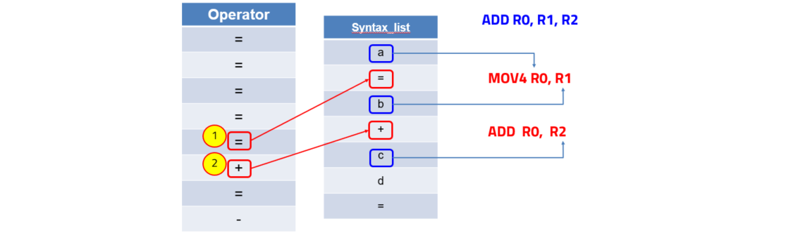

#### MOV4, SUB

It is same that add code generation.

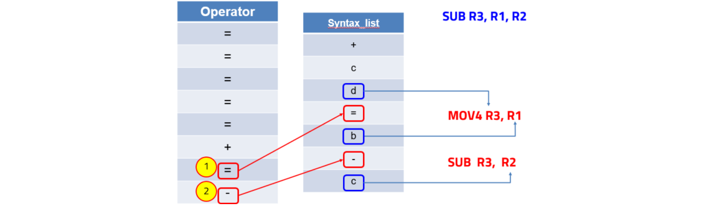

## 4. OUTPUT

You can see output like below.

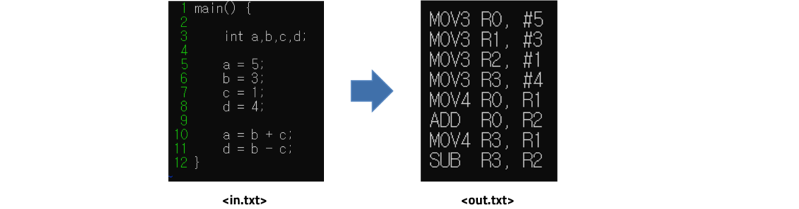

then, look at assembler and decoder together.

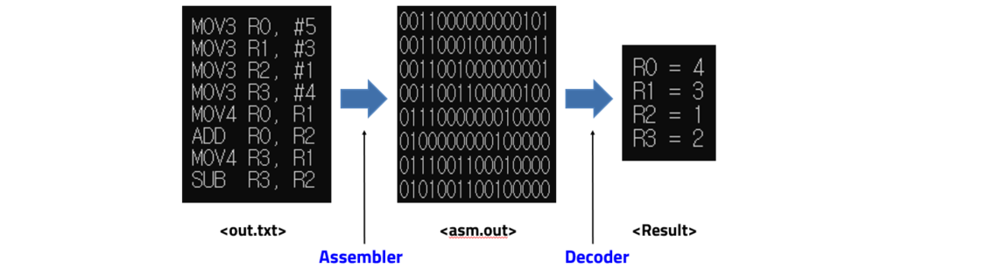


